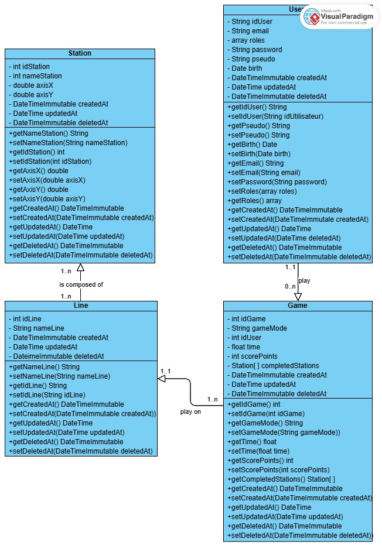

# FerroviPath

FerroviPath est un site interactif conçu pour tous ceux qui souhaitent découvrir et mémoriser les réseaux de transports en commun ! Que vous soyez passionné ou simplement curieux, testez vos connaissances en reconstituant les lignes de métro de différentes villes avec leurs stations exactes.

# Règles du jeu

Une fois avoir sélectionné une ligne de métro, l'objectif sera d'écrire toutes les lignes de métros d'une ligne associée dans le meilleur délai. Un classement est effectué et mis à jour en temps réel sur les meilleures performances des utilisateurs.

# Technologies Utilisées

Le site FerroviPath est entièrement codé avec différents langages de programmation web tels que HTML,CSS,JavaScript et le framework PHP Symfony. On utilise le SGBD Adminer et le langage SQL MySQL pour gérer nos données.

# Diagramme de classe

# Instructions d'exécution du projet

Dans un premier temps, étant donné que le projet a été lancé en local dans le groupe, il faut aller dans le .env et changer le "localhost" par db pour le lancer via docker.
Ensuite après avoir fait la commande "make up", il faut également faire la commande "make js" et "make db" pour mettre à jour les fichiers js et la base de données.

Remarque: Si l'ordinateur utilisé pour lancer le projet est un Windows, les commandes dans le MakeFile doivent être adaptées pour le terminal windows:

js:
	if exist public\assets rmdir /s /q public\assets
	php bin/console asset-map:compile

db:
	@echo Suppression de toute la base de donnée (no panic)
	php bin/console doctrine:database:drop --force --if-exists
	@echo Recréation de la nouvelle BDD
	php bin/console doctrine:database:create
	@echo Suppression des anciennes migrations
	if exist migrations\*.php del /q migrations\*.php
	@echo Recréation d'une nouvelle migration
	php bin/console make:migration
	@echo Exécution de la migration
	php bin/console doctrine:migrations:migrate --no-interaction
	php bin/console doctrine:schema:update --force
	@echo Chargement des fixtures
	php bin/console doctrine:fixtures:load --no-interaction
	@echo La base de donnée a été recréée avec succès !

Une fois avoir lancé toutes ces commandes amusez-vous sur notre site FerroviPath ! 